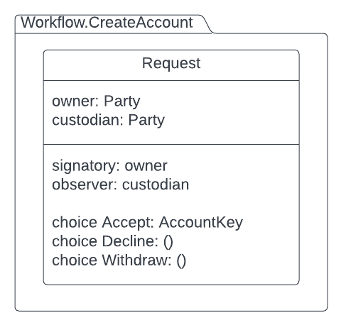

# Creating Accounts

When a potential account owner wants to create an account with a custodian, then it uses the  **Propose-Accept pattern** and sends a request. The custodian may accept the requet, in which case the **Factory pattern** is used to create an account using the **Account Factory**. The Account Factory creates an account and returns an **AccountKey** to the owner. If the request is either declined by the custodian or withdrawn by the owner, then nothing happens. 

For this we will create a module called CreateAccount with one template called Request in it. 



Let us take a look at the code for this template.

```
module Workflow.CreateAccount where

import DA.Map qualified as M (fromList)
import DA.Set qualified as S (fromList, singleton)
import Daml.Finance.Interface.Account.Account qualified as Account (Controllers(..))
import Daml.Finance.Interface.Account.Factory qualified as Account (Create(..), F)
import Daml.Finance.Interface.Holding.Factory qualified as Holding (F)
import Daml.Finance.Interface.Types.Common.Types (AccountKey(..), Id(..))

template Request
  with
    custodian : Party
    owner : Party
  where
    signatory owner
    observer custodian

    choice Accept : AccountKey
      with
        label : Text
        description : Text
        accountFactoryCid : ContractId Account.F
        holdingFactoryCid : ContractId Holding.F
        observers : [Party]
      controller custodian
      do
        let
          observersSet = S.fromList observers
          accountKey = AccountKey with custodian = custodian, owner = owner, id = Id label

        accountCid <- exercise accountFactoryCid Account.Create with
          account = accountKey
          description = description
          holdingFactoryCid = holdingFactoryCid
          controllers = Account.Controllers with
            outgoing = S.singleton owner
            incoming = S.singleton owner
          observers = M.fromList [("AccountObservers", observersSet)]

        pure accountKey

    choice Decline : ()
      controller custodian
      do pure ()

    choice Withdraw : ()
      controller owner
      do pure ()
```

The Request contract is created by the potential owner of the account. Notice the two contractd ids being passed in this request: **accountFactoryCid** and **holdingFactoryCid**. The accountFactoryCid is the Cid of the Account factory to create an account. The holdingFactoryCid is required to establish a reference between Account and its Holding. 

The **Accept** choice is exercised by the custodian. The body of this choice shows the Account.Create choice being exercised using the accountFactoryCid where Account is the qualified name for Daml.Finance.Interface.Account.Factory as given in the import statement. 


