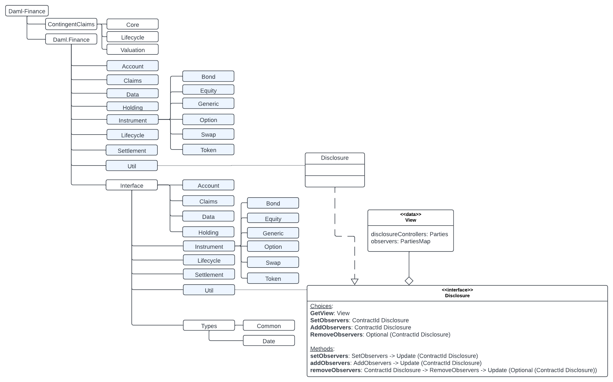
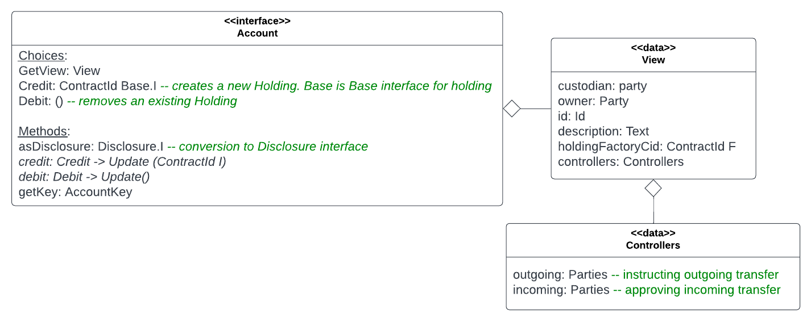

# Daml Finance Library Structure

Daml Finance library is a collection of interfaces and their implementations in templates. A high level structure of the packages in the library is as shown below. 

The packages listed under Daml.Finance, such as Account and Claims, contain the implementations of the interfaces residing in the packages listed under Interface. So Daml.Finance.Interface.Account contains the Account interface that is implemented by the Account template residing in Daml.Finance.Account. 

These interfaces are related to each other through a hierarchy, at the top of which is the **Disclosure** interface inside **Daml.Finance.Interface.Util**. All interfaces in Holding and Account packages inherit from the Disclosure interface. 

**Disclosure** is the ability to reveal a contract to a third party by adding them as an observer. As evident from the choices shown in the Disclosure interface in the diagram above, SetObservers, AddObservers, and RemoveObservers provide that functionality. 

To start with, we need to understand the following interfaces to help us understand our first Transfer workflow:

1. Account
2. Account Factory
3. Disclosure
4. Holding
5. Holding Factory
6. Instrument

## Account Interface

