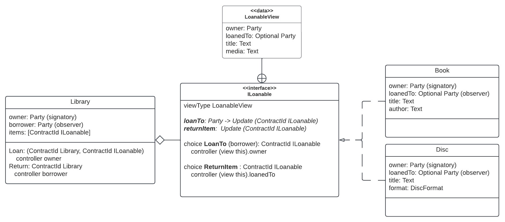

# Daml Interface

Daml interface is an abstract type whose behavior is specified by:

- ‘view’ record
- method signatures
- choices

The abstraction specified in an interface is implemented in a template by: 

- creating an instance of the interface
- providing values for ‘view’ record
- implementing the choices and methods

Let us take an example to understand how this works. Let us think of a Library that loans out different types of media, such as Books and Discs, to its patrons.




To model this scenario, we will write a template named **Library** that has an owner and a borrower as its signatories, and has a list of items that can be loaned out. If we do not apply the concept of Interface, then the Library will need two sets of choices - one for Book and one for Disc - as they have some differences. For example, in this case, one difference could be that a Book has a field - author, and Disc has a field - DiscFormat - which can be either DVD or BluRay. So the Library template will need choices: LoanBook, ReturnBook, LoanDisc, ReturnDisc to address these differences. This creates inefficient and inextensible code.

To alleviate this problem, we create an interface called **ILoanable**. It has three key components.
- **view**: we have a data record named **ILoanable** that has owner, loanedTo, title, and media. This data record becomes the **viewType** of the interface. 
- **method signatures**: We have method signatures for two methods - **loanTo** and **returnItem**.
- **choices**: the two choices - LoanTo and ReturnItem - which will use the above two methods. 

With this interface defined, we can now create templates for different media types, create an instance of the interface within those templates, and implement the functions and choices as per the media needs. Let us take a look at the code for this example, starting with the interface.  

```
data LoanableView = LoanableView
    with 
        owner: Party 
        loanedTo: Optional Party 
        title: Text 
        media: Text 

interface ILoanable where 
    viewtype LoanableView 
    loanTo: Party -> Update (ContractId ILoanable)
    returnItem:  Update (ContractId ILoanable)

    choice LoanTo: ContractId ILoanable 
        with 
            borrower: Party 
        controller (view this).owner 
        do 
            loanTo this borrower

    choice ReturnItem: ContractId ILoanable
        controller (view this).loanedTo 
        do 
            returnItem this 
```

An interface declaration is similar to a template declaration starting with the keyword **‘interface'** followed by the name of the interface and then the keyword **where**.The interface name must begin with a capital letter.

Next is the **viewtype**. All interfaces must implement a special view method which returns a value of the type declared by viewtype which must be a record. In this example, this viewtype is defined as **LoanableView** that has four properties - owner, media, title, and loanedTo

Then come the abstract methods that are **method signatures** without their implementation. An interface can have any number of methods. These method signatures consist of a method name starting with a lower-case letter. One implicit input to the method is the Interface instance itself, followed by other input types and return values, if any.

In this example, we have a method **loanTo** that takes a Party and returns an update with ContractId of type ILoanable. This method will translate to a function with the same name that maps the Interface to the method signature. So the loanTo method that takes a Party as an input and returns an Update with ContractId ILoanable introduces the function loanTo that maps the ILoanable interface to a Party that then results in the Update with ContractId ILoanable. 
Same logic applies to the returnItem method. 


| Method signature | Function |
| ---------------- | ----------- |
| loanTo: Party -> Update (ContractId ILoanable)   | loanTo: ILoanable -> Party -> Update (ContractId ILoanable) |
| returnItem: update (ContractId ILoanable) | returnItem: ILoanable -> Update (ContractId ILoanable)


Finally, the interface **choices** for which we need to look at how they are implemented. As you may notice, this interface does not have any media specific property such as an author or media format. Let us now implement this interface for the two media types - Book and Disc.

```
template Book 
    with 
        owner: Party 
        loanedTo: Optional Party 
        title: Text 
        author: Text 
    where 
        signatory owner 
        observer loanedTo 

        interface instance ILoanable for Book where 
            view = LoanableView 
                owner
                loanedTo              
                title 
                "Book" 
                 
            loanTo borrower = do 
                loanedBook <- create this with loanedTo = Some borrower 
                return (toInterfaceContractId loanedBook)

            returnItem = do 
                returnedBook <- create this with loanedTo = None
                return (toInterfaceContractId returnedBook)
```

The code above shows the **Book** template with its specific properties - owner, loanedTo, title, and author. Inside the where block, the interface is implemented by creating an interface instance. 

In the where block, the LoanableView of the interface is allocated values using the Book properties. Notice that the sequence of Book properties must be listed in the same order as the LoanableView fields, i.e. owner, loanedTo, media, and then title. 

Next, the loanTo method is implemented which takes party as the borrower who is the controller of the LoanTo choice where this method is used. The method creates ‘this’ which means a Book contract with loanedTo assigned as the borrower. 

There are two important points to note here:

- First, the choices written in the interface are using the methods that are implemented in the Book template. This is how an abstract choice is implemented by the interface’s instances.
- Second, the return type of the loanTo and returnItem methods in the Book template use the **toInterfacecontractId** function to convert the Books’ contractId to ILoanable ContractId.

Similarly, the returnItem method is implemented to be used in the ReturnItem choice. 

Let us take a look at how the other media, i.e. the Disc, implements the ILoanable interface. This being a simple example, most of the implementation across Book and Disc is the same. To introduce some variation in Disc, we have introduced just one small change by making its format as a record of type DiscFormat which can be either DVD or BluRay. The view is then implemented where the format value is given as show format.

```
data DiscFormat = DVD | BluRay
   deriving (Eq, Show)

template Disc
   with
       owner: Party
       loanedTo: Optional Party
       title: Text
       format: DiscFormat
   where
       signatory owner
       observer loanedTo
       interface instance ILoanable for Disc where
           view = LoanableView
               owner
               loanedTo
               title
               (show format)                            
           loanTo borrower = do
               loanedDisc <- create this with loanedTo = Some borrower
               return (toInterfaceContractId loanedDisc)
           returnItem = do
               returnedDisc <- create this with loanedTo = None
               return (toInterfaceContractId returnedDisc)
```

Now that we have our media types defined. We an write up the code for our Library which uses these media. As shown in the code below, the Library template does not need to know any specific media such as Book or Disc as it only deals with ILoanables. 


```
template Library 
    with
        owner: Party 
        borrower: Party
        items: [ContractId ILoanable]
    where 
        signatory owner 
        observer borrower
        
        choice Loan: (ContractId Library, ContractId ILoanable)
            with 
                item: ContractId ILoanable 
            controller owner 
            do 
                assert (item `elem` items)
                loanedItem <- exercise item LoanTo with ..
                let newItems = replace [item] [loanedItem] this.items
                newLibraryCid <- create this with items = newItems
                return (newLibraryCid, loanedItem)


        choice Return: ContractId Library 
            with 
                item: ContractId ILoanable
            controller borrower 
                do 
                    assert (item `elem` items)
                    returnedItem <- exercise item ReturnItem 
                    let newItems = replace [item] [returnedItem] this.items
                    create this with items = newItems
                    
```

This example illustrates how using interfaces allows us to make our applications loosely coupled and easily upgradeable as it separates the application into two layers - an abstract layer represented by interfaces  and an implementation layer which uses the interfaces. 


We are now ready to learn about the [Factory Pattern](FactoryPattern.md). 

