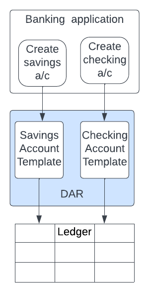
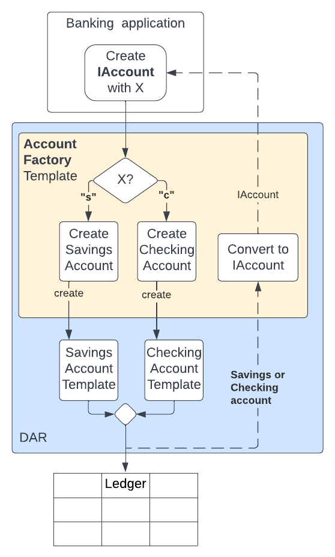

# Factory Pattern

**Factory pattern** is a creational pattern which abstracts out the logic of creating a contract from the code that needs to create it. In other words, it allows us to create contracts without knowing their creational logic. This is done by providing an API to create a contract and exposing it to the client application. The implementation layer of that API creates the contracts. This separation helps in decoupling and upgradeability of the application.

Let us take an example. There is a bank that offers Checking and Savings accounts to its customers. One of the functionalities for its banking application is to create these accounts.

<table>
<tr>

<td> 


*Fig.1: Design without Factory Pattern*

</td>
<td>
As depicted in <b>Fig.1</b>, one design approach could be to have a template for each of these account types, each of which will have some choices such as deposit, withdraw, etc. When a new account is to be created, the application gets the corresponding template to create its account. This approach has some problems:
<br></br>
<ul><li>There will be a significant amount of repetitive code as most of the account creation process will be similar across different account types</li>
<li>The banking application will be tightly coupled to all difference kinds of different account templates. Any changes in any of account templates will require changing and testing the banking application. </li>
</ul>

</td>
</tr>
</table>

<table
<tr>
<td>



*Fig.2: Design using Factory Pattern* 

</td>
<td>
Factory pattern, as depicted in <b>Fig. 2</b>, separates the banking application's need to create accounts from the actual creation of the accounts by introducing an intermediary template - <b>Account Factory template</b> - that takes the basic instruction to create an account with some details on the type of account and then does the job of creating the accounts itself.

The benefit is that the Banking application now depends only on the Account Factory template. Any changes in the account specific templates will not impact the Banking application. 

Furthermore, this decoupling can be made even better by making the Banking application see all accounts as an abstract type, or an interface, say <b>IAccount</b>, so that it can manage all accounts as IAccounts without having to know the internal differences among them. 

The Account Factory will look at 'X' sent by the banking application to decide which type of account is needed. It will create that account, convert its ContractId to the IAccount type, as that is what the Banking Application can work with, and send it back. 
</td>
</tr>
</table>

Let us now take a look at the code to see how this idea is implemented. 

To start with, let us create a simple interface for IAccount that just has a viewType, with no methods or choices, as they are not required for this example.

```
module FactoryPattern where

data AccountView = AccountView 
    with 
        custodian: Party 
        owner: Party
        id: Text
        balance: Decimal 
        accountType: Text
            deriving (Show)  --to print
        
interface IAccount where 
    viewtype AccountView
```

The code above shows **IAccount** interface that uses **AccountView** as its **viewtype**, which means that this data will be visible when **view** function will be invoked. All templates that implement an interface must implement its view-function. Let us see its implementation by a template named **SavingsAccount**.

```
template SavingsAccount 
    with 
        custodian: Party
        owner: Party
        id: Text
        balance: Decimal
        interestRate: Decimal
    where 
        signatory custodian  
        observer owner

        interface instance IAccount for SavingsAccount where 
            view = AccountView 
                custodian
                owner
                id 
                balance 
                "S"
```

The code above shows **SavingsAccount** fields, most of which, as you may notice, are same as the fields in AccountView. This is because these fields are common across different account-types, and hence made part of the interface. 

However, there is one field **interestRate** which is unique to SavingsAccount, indicating that you may have some specialized fields that are not part of the 'view' but are there in the template. 

The next important observation to be made here is how the interface is instantiated by the template in the statement

```
interface instance IAccount for SavingsAccount where 
```
This statement is where the template impelements the interface. The **view** function is imeplemented where the fields of the template are mapped to the fields in AccountView data type. It is important to note that the order of template-fields written here must match with the order of fields written in the AccountView definition. 

Finally, note that the accountType field is mapped to value "S" which indicates that the account is of type SavingsAccount. This field will be used by the AccountFactory at the time of creating the accounts. 

The following block of code shows the **CheckingAccount** template implementing the interface. 

```
template CheckingAccount 
    with
        custodian: Party
        owner: Party
        id: Text
        balance: Decimal
    where 
        signatory custodian  
        observer owner

        interface instance IAccount for CheckingAccount where 
            view = AccountView 
                custodian
                owner
                id
                balance
                "C"
```

Now that we have the interface and two types of accounts ready, we can use them in the **AccountFactory** template. 

```
template AccountFactory 
    with 
        custodian: Party 
    where 
        signatory custodian 

        nonconsuming choice CreateNewAccount: ContractId IAccount 
            with 
                owner: Party
                id: Text
                balance: Decimal
                accountType: Text
            controller custodian 
            do
                if (accountType == "S") then do
                    accountCid <- create SavingsAccount with 
                        custodian
                        interestRate = 2.5
                        ..
                    return (toInterfaceContractId accountCid )
                else  do 
                    accountCid <- create CheckingAccount with 
                        custodian
                        ..
                    return (toInterfaceContractId accountCid)
```

This template has the choice **CreateNewAccount** that can be exercised by the custodian. There are three important observations to be made here:

- The return type of the choice CreateNewAccount is ContractId IAccount. 
- The creational logic is to check if the accountType is "S" or "C". If it is "S", a SavingsAccount is created, initializing its unique field interestRate to some value, say 2.5. Similarly, if it is "C", a CheckingAccount is created. 
- The return statement uses the **toInterfaceContractId** function to convert the ContractID from SavingsAccount or CheckingAccount to IAccount. 

Finally, let us write a script and explore how an external application can use the IAccount interface to create accounts. 

```
module TestFactoryPattern where 

import Daml.Script
import FactoryPattern

testFactory: Script () 
testFactory = script do 

    alice <- allocateParty "Alice"
    bank <- allocateParty "Bank"

-- create the factory
    factoryCid <- submit bank do 
        createCmd AccountFactory with 
            custodian = bank

--create Savings Account
    accountCid1 <- submit bank do 
        exerciseCmd factoryCid CreateNewAccount with 
            owner = alice
            id = "123"
            balance = 100.0
            accountType = "S"

-- create Checking Account
    accountCid2 <- submit bank do 
        exerciseCmd factoryCid CreateNewAccount with 
            owner = alice 
            id = "234"
            balance = 200.0
            accountType = "C"

-- print IAccounts
    accountTuples <- queryInterface @IAccount bank    
    debug accountTuples

    return ()
```

In this script, the bank first creates a factory using AccountFactory template, and then exercises CreateNewAccount choice on it to create SavingsAccount and CheckingAccount. Notice the accountType as "S" and "C" for the two accounts. 

Finally, it queries using **queryInterface** to get the active account contracts visible to the bank that have been created using the templates that have implemented the IAccount template. The trace of this script shows the following output:

```
Trace: 
  [(004486c8fe750caafb1d6334008250da93ca933808fefcc0c46715f41255dfd711,Some (AccountView {custodian = 'Bank', owner = 'Alice', id = "123", balance = 100.0, accountType = "S"})),(0019c07c056e8768760f6d7814cf2a1455770653e88062c2d2e199c9c9156eb37a,Some (AccountView {custodian = 'Bank', owner = 'Alice', id = "234", balance = 200.0, accountType = "C"}))]
```
Notice that the only fields visible here are the ones that were in AccountView as part of IAccount. The field **interestRate** that was unique to SavingsAccount template is not visible. 

With this example, you can now see that we can add more types of accounts as templates and have them implement the IAccount interface. The client application will provide the data and AccountFactory will create the account as needed. 

Now that we have learned about the use of Factory patterns, we can explore some workflows and see how these concepts are used in Daml Finance library. We will start with the [Transfer workflow](../Module3/TransferWorkflow.md). 