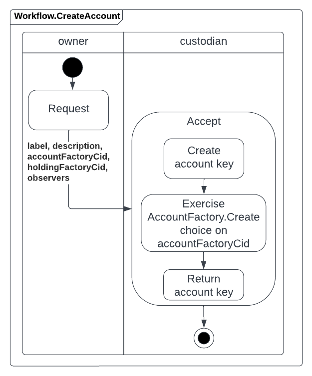
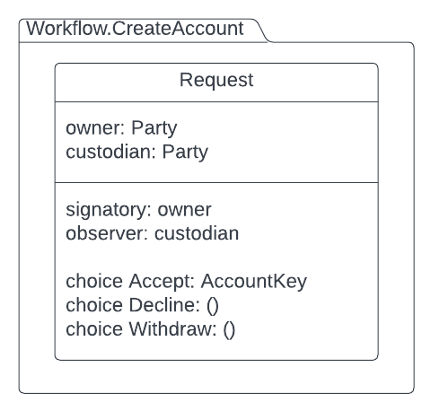

# Creating Accounts

In this lesson, you will learn how to create an account using Daml Finance library. You will also learn how Propose-Accept and Factory patterns are used in this functionality. 

---------------




When a potential account owner wants to create an account with a custodian, it sends a request to the custodian. The custodian may accept or reject the requet. This approachis based on Propose-Accept pattern. 

If the custodian accepts the request then an account is created using the **AccountFactory**. The Account Factory creates an account and returns an **AccountKey** to the owner. You can see the Factory pattern being applied here.

If the request is either declined by the custodian or withdrawn by the owner, then no action is taken.  

For this logic, we will create a module called CreateAccount with one template called Request in it. 




```
module Workflow.CreateAccount where

import DA.Map qualified as M (fromList)
import DA.Set qualified as S (fromList, singleton)
import Daml.Finance.Interface.Account.Account qualified as Account (Controllers(..))
import Daml.Finance.Interface.Account.Factory qualified as AccountFactory (Create(..), F)
import Daml.Finance.Interface.Holding.Factory qualified as Holding (F)
import Daml.Finance.Interface.Types.Common.Types (AccountKey(..), Id(..))

template Request
  with
    custodian : Party
    owner : Party
  where
    signatory owner
    observer custodian

    choice Accept : AccountKey
      with
        label : Text
        description : Text
        accountFactoryCid : ContractId AccountFactory.F 
        holdingFactoryCid : ContractId Holding.F
        observers : [Party]
      controller custodian
      do
        let
          observersSet = S.fromList observers
          accountKey = AccountKey with custodian = custodian, owner = owner, id = Id label

        accountCid <- exercise accountFactoryCid AccountFactory.Create with
          account = accountKey
          description = description
          holdingFactoryCid = holdingFactoryCid
          controllers = Account.Controllers with
            outgoing = S.singleton owner
            incoming = S.singleton owner
          observers = M.fromList [("AccountObservers", observersSet)]

        pure accountKey

    choice Decline : ()
      controller custodian
      do pure ()

    choice Withdraw : ()
      controller owner
      do pure ()
```

The Request contract is created by the potential owner of the account. 

Let us look at the Accept choice, starting with its input parameters. All these fields are used by the AccountFactory to create an account.  
- **label**: used to create an AccountKey for the account. AccountKey is a data record defined in the module Daml.Finance.Interface.Types.Common.Types and has the following definition:

```
data AccountKey = AccountKey
  with
    custodian : Party
    owner : Party
    id : Id
  deriving (Eq, Ord, Show)
```

The Id type used for id is defined as 

```
newtype Id = Id Text
  deriving (Eq, Ord)
```

- **description**: human readable description of the account
- **accountFactoryCid**: Cid of the account factory to create the account
- **holdingFactoryCid**: Cid of the holding required to establish a reference between account and its holding
- **observers**: list of observers for the account


The **Accept** choice is exercised by the custodian. The body of this choice has the following steps:

1. Extract the list of observers into **observersSet** 
2. Create the account key using the custodian, owner and the label.
3. Exercise **Create** choice on AccountFactory with Cid accountFactoryCid. Notice the controller for the account is assigned using **Account.Controllers**, which is a data record defined in DamlFinance.Interface.Account.Account module as shown below:

```
data Controllers = Controllers
  with
    outgoing : Parties -- Parties instructing a transfer (outgoing).
    incoming : Parties -- Parties approving a transfer (incoming).
  deriving (Eq, Show)
```

Since the Controller is just the owner, the outgoing and incoming controllers are set as singleton lists with owner as the single element. 

4. Create a PartiesMap from the list of observers. PartiesMap is yet another type defined in Daml.Finance.Interface.Types.Common.Types module as follows: 

```
type Parties = Set Party -- a set of parties
type PartiesMap = Map Text Parties -- Parties mapped to a key to allow add/remove
```


Now we have the template ready for the owner to make a request to the custodian, and for the custodian to accept the request to create the account. Next step in our workflow is to issue a cash instrument to be deposted into the new account. 

But before that, let us write a script to [test creating accounts](TestCreatingAccounts.md). 
