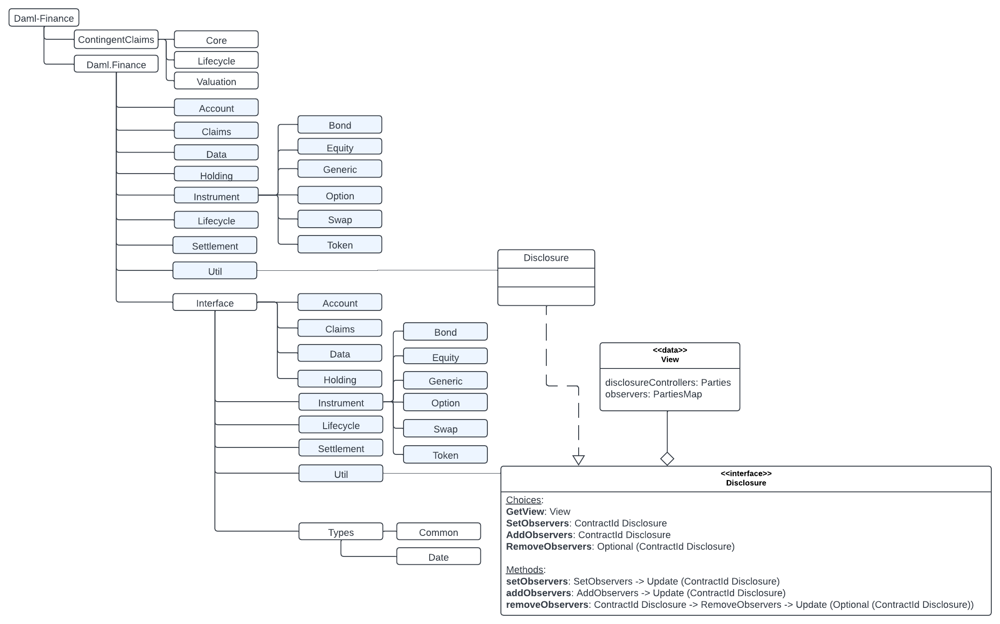
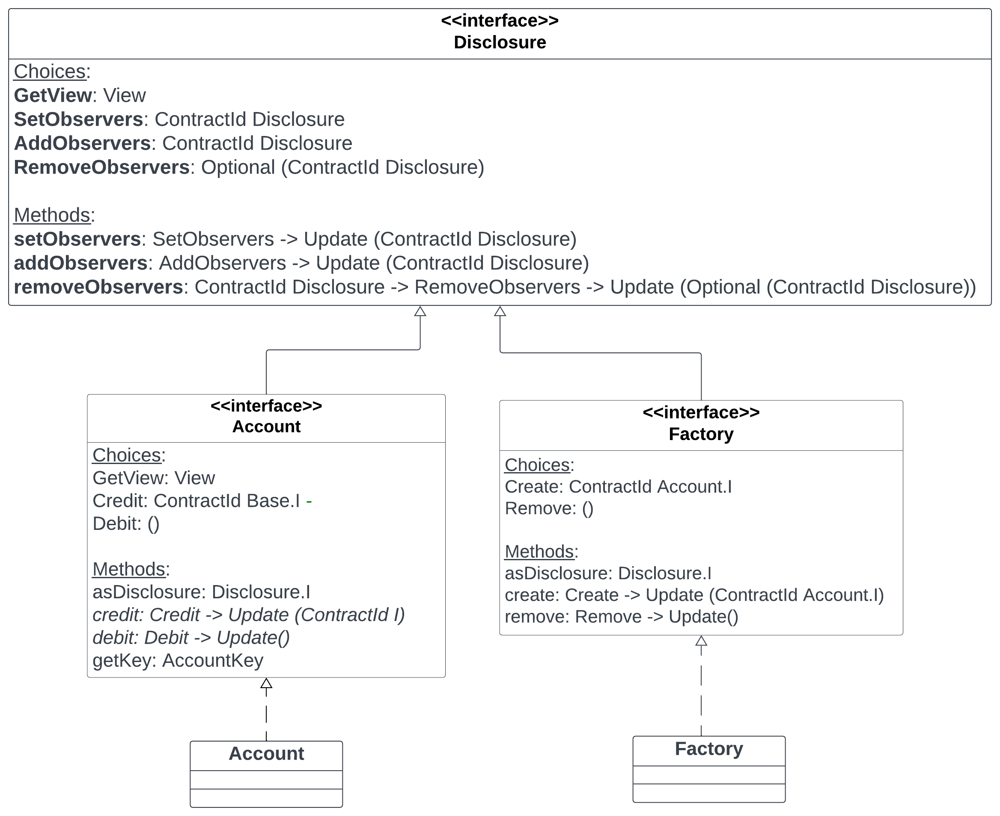

# Daml Finance Library Structure

In this lesson, you will learn about how the Daml Finance library packages, interfaces, and their implementations are organized. 

-----------

Daml Finance library is a collection of interfaces and their implementations in templates. A high level structure of the packages in the library is as shown below. 

The packages listed under Daml.Finance, such as Account and Claims, contain the implementations of the interfaces residing in the packages listed under Interface. So Daml.Finance.Interface.Account contains the Account interface that is implemented by the Account template residing in Daml.Finance.Account. 

These interfaces are related to each other through a hierarchy, at the top of which is the **Disclosure** interface inside **Daml.Finance.Interface.Util**. All interfaces in Holding and Account packages inherit from the Disclosure interface. 

**Disclosure** is the ability to reveal a contract to a third party by adding them as an observer. As evident from the choices shown in the Disclosure interface in the diagram above, SetObservers, AddObservers, and RemoveObservers provide that functionality. 

The diagram shown below illustrates that Disclosure is the highest level interface from which Account and Factory interfaces inherit the choices and abstract method signatures. Therefore the Account template that implements the Account interface will also need to implement the methods flowing from Disclosure interface. The same logic applies to the Factory implementation as it will have to implement the methods from Disclosure as well as Factory interfaces. 

 

Let us now look at the first step in the workflow which is to [create accounts](CreatingAccounts.md). 