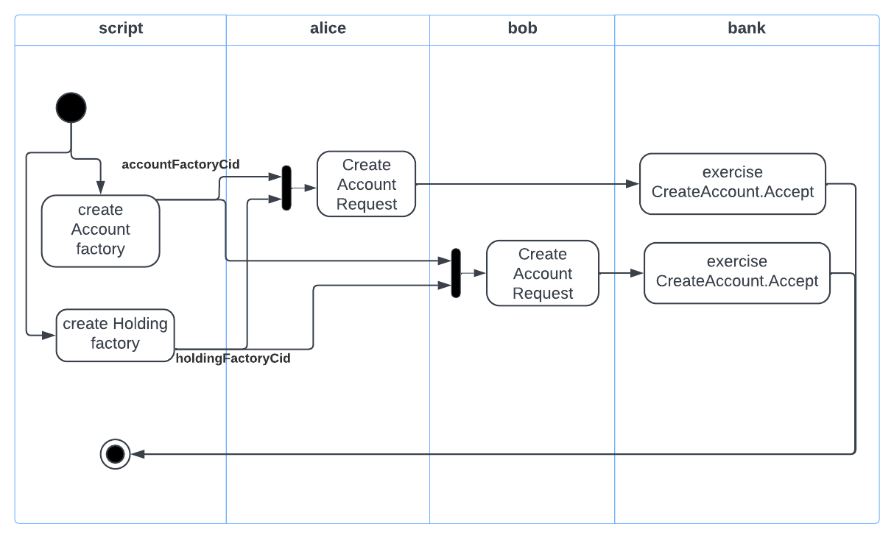
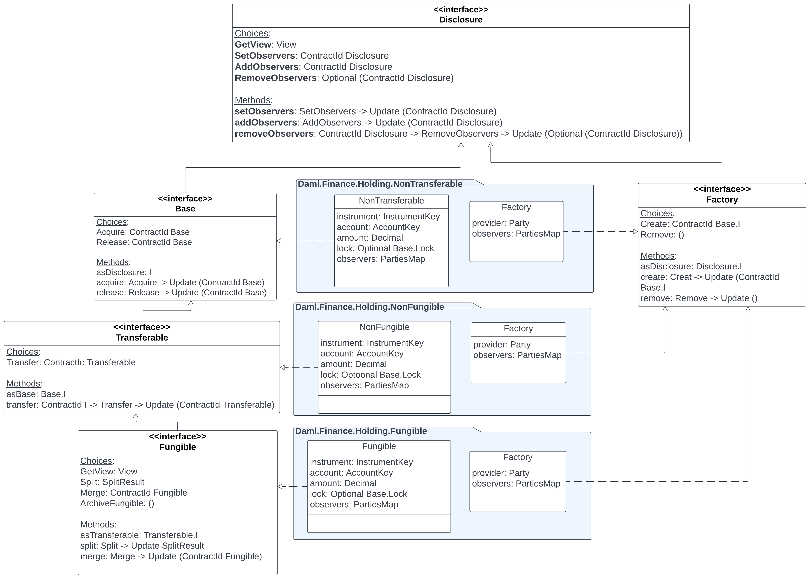

# Test Creating Accounts

In this lesson, you will learn how to test the account creation step coded in **CreateAccount.daml** as part of the Transfer workflow. 

----------



As shown in the figure above, we want to test the following workflow to test the CreateAccounts functionality: 

1. Create Account factory
2. Create Holding factory
3. Use the contracts ids from above for 
- Alice to create account request
- Bob to create account request
4. Bank accepts Alice's request
5. Bank accepts Bob's request


Let us first write the code to create Alice's account. 

```
module Scripts.Transfer where

import DA.Map (empty, fromList)
import DA.Set (singleton)
import Daml.Script

-- INTERFACE DEPENDENCIES --
import Daml.Finance.Interface.Account.Factory qualified as Account (F)
import Daml.Finance.Interface.Holding.Factory qualified as Holding (F)

-- IMPLEMENTATION DEPENDENCIES --
import Daml.Finance.Account.Account qualified as Account (Factory(..))
import Daml.Finance.Holding.Fungible qualified as Fungible (Factory(..))

import Workflow.CreateAccount qualified as CreateAccount

testCreateAccount: Script () 
testCreateAccount = script do 
 
    [alice, bank, public] <- mapA allocateParty ["Alice", "Bank", "Public"] 

    -- create Account Factory
    accountFactoryImplCid <- submit bank do
        createCmd Account.Factory with provider = bank; observers = empty
    -- convert the factory implementation cid to interface Cid 
    let accountFactoryInterfaceCid = toInterfaceContractId @Account.F accountFactoryImplCid

    -- create Holding factory
    holdingFactoryImplCid <- submit bank do 
        createCmd Fungible.Factory with 
            provider = bank 
            observers = fromList [("PublicObserver", singleton public)]
    -- convert the factory implementation cid to interface Cid
    let holdingFactoryInterfaceCid = toInterfaceContractId @Holding.F holdingFactoryImplCid

    -- alice requests for an account
    aliceRequestCid <- submit alice do 
        createCmd CreateAccount.Request with 
            owner = alice
            custodian = bank 
    -- bank accepts request
    aliceAccountCid <- submit bank do 
        exerciseCmd aliceRequestCid CreateAccount.Accept with 
            label = "Alice@Bank"
            description = "Alice's account"
            accountFactoryCid = accountFactoryInterfaceCid 
            holdingFactoryCid = holdingFactoryInterfaceCid
            observers = []

    return ()

```

### <a name="createAccountFactory"></a>Create Account Factory

The first important step is creating the account factory

```
    -- create Account Factory
    accountFactoryImplCid <- submit bank do
        createCmd Account.Factory with provider = bank; observers = empty
    -- convert the factory implementation Cid to interface Cid 
    let accountFactoryInterfaceCid = toInterfaceContractId @Account.F accountFactoryImplCid
```

Notice that we need to use the account factory's implementation, i.e. **Account.Factory** to create the factory. However, the account created from this factory needs its interface type in the accountFactoryCid field, so we use **toInterfaceContractCId** to convert it into interfce type. 

### Create Holding Factory

Same logic as above applies to holding factory as well. 

```
    -- create Holding factory
    holdingFactoryImplCid <- submit bank do 
        createCmd Fungible.Factory with 
            provider = bank 
            observers = fromList [("PublicObserver", singleton public)]
    -- convert the factory implementation Cid to interface Cid
    let holdingFactoryInterfaceCid = toInterfaceContractId @Holding.F holdingFactoryImplCid
```

An important observation here is the use of **Fungible.Factory**. If you recall from previous lessons, a **holding** represents the ownership of a certain amount of an instrument by an owner at a custodian. A holding can have specific properties such as being **fungible / non-fungible**, or **transferable**. These properties are expressed in Daml Finance library as three interfaces and three implementations of the holding factory that result in the three different types of holdings. This structure is depicted in the diagram below:




The holding that implements the Base interface results in a Non-transferable holding. The Transferable interface when implemented gives a Transferable holding, and a Fungible interface implementation gives us a Transferable as well as Fungible holding. 

In the example code shown above, we want the account to hold cash instrument which is a fungible and a transferable instrument. And the factory that can create such a holding is in **Daml.Finance.Holding.Fungible** package. 

### Create Account

Finally, the steps for alice requesting for an account and the bank accepting the request resulting in account creation are fairly straighfroward. 

```
   -- alice requests for an account
    aliceRequestCid <- submit alice do 
        createCmd CreateAccount.Request with 
            owner = alice
            custodian = bank

    -- bank accepts request
    aliceAccountCid <- submit bank do 
        exerciseCmd aliceRequestCid CreateAccount.Accept with 
            label = "Alice@Bank"
            description = "Alice's account"
            accountFactoryCid = accountFactoryInterfaceCid 
            holdingFactoryCid = holdingFactoryInterfaceCid
            observers = []
```

We now have an account factory, a holding factory, and an account for Alice that carries Cids of two factories. 

Go ahead and complete the script by having Bob submit an account request and then Bank accpeting his request to create his account. 
