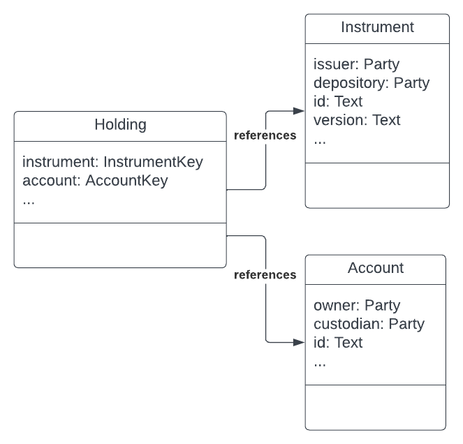

# Transfer Workflow

To understand the core concepts used in the Daml Finance library, we will use some example workflows. The first workflow we will look at is the Transfer workflow

The transfer workflow comprises the following steps:

- create accounts for Alice and Bob at the Bank
- issue a cash instrument
- credit a cash holding to Alice's account
- transfer the holding from Alice to Bob

This workflow uses the following key terms:

**Instrument**
: a contract that describes the economic terms (rights and obligations) of one unit of a financial contract. For example, cash is an instrument. 
- An Instrument defines 'what' a party holds. 
- Every instrument must have an issuer party and a depository party that prevents the issuer from potentially acting maliciously. 
- Instruments are identified by **InstrumentKey**, which comprises: issuer, depository, a textual id, a textual version

**Holding**
: a contract that represents the ownership of a certain amount of an instrument by an owner at a custodian. 
- A Holding defines 'how much' of an instrument and 'against which party' (i.e. the custodian) the instrument is being held.
- Every holding must have an owner party and a custodian party.
- A holding can have specific properties such as being fungible / non-fungible, or transferable.

**Account**
: a contract that represents a relationship between two parties : a custodian (or account provider, e.g. a bank) and an owner. 
- An account is a proof of relationship between a custodian and an owner. An owner must have an account with the custodian before a holding contract is created between the two parties
- An account contract controls which parties are authorized to transfer holdings in and out of the account
- Accounts are identified by **AccountKey** which comprises: owner, custodian, a textual id

A holding references an account because it is the account that controls who is entitled to instruct and receive holding transfers. It also references instruments as instruments represent what is held in the holding.

Before we start writing our code, let us take a look at the [Daml Finance library structure](DamlFinanceStructure.md).

