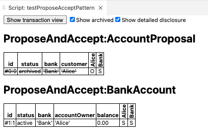

# Propose-Accept Pattern

The **propose-accept pattern** is applicable in the scenario where there is a bilateral workflow. For example, when Alice seeks a contractual relationship with Bob, she cannot just write up a contract and ask Bob to sign on it. First she will have to initiate an offer or propose to Bob. Only when Bob accepts the offer can the contract be created and then signed. 

According to the pattern, when Party A wants to create a contractual relationship with Party B, it will make a proposal to Party B. Party B can then decide to either accept, reject, or possibly negotiate the terms and conditions of the contract. If Party B accepts, then a contract between Party A and B is created. 

This pattern works well only when the agreement is only between two parties. If there is a need for a multi-party agreement, then this pattern can get quite verbose and confusing. In that case, you may want to explore the Multiple-Party Agreement Pattern in Daml Docs that provides a different solution to address the problem. 

For now, let us see the propose-and-accept pattern implemented in code. 

Here is a simple template BankAccount with the bank and the accountOwner as two parties who are also signatories. 

```
module ProposeAndAccept where

template BankAccount 
    with 
        bank: Party 
        accountOwner: Party 
        balance: Numeric 2

    where 
        signatory bank, accountOwner

        choice CreateProposal : ContractId AccountProposal 
            with 
                customer: Party 
            controller bank 
            do 
                create AccountProposal 
                    with 
                        ..
```
A bank cannot unilaterally open an account for a party. It has to first get the agreement from the other party. So, according to the Propose-and-Accept pattern, it first creates a proposal called AccountProposal which is another template shown below. In the AccountProposal template, the bank and the customer are two parties. The customer is not an account owner yet. While the signatory of the AccountProposal template is the bank, the controller for the two choices in it is the customer. Only the customer can exercise the two choices: AcceptProposal or RejectProposal. If it accepts the proposal, then the BankAccount contract is created with the customer as its accountOwner. If the customer rejects the proposal, then nothing happens. 

```
template AccountProposal 
    with 
        bank: Party 
        customer: Party 

    where 
        signatory bank
        observer customer 

        choice AcceptProposal: ContractId BankAccount 
            controller customer 
            do 
                create BankAccount with 
                    bank
                    accountOwner = customer 
                    balance = 0.0 
        
        choice RejectProposal: () 
            controller customer 
            do 
                return ()
```
Now let us play out this scenario in a test-script. In this scenario, we have alice and bank as two parties. First, the bank submits a createCmd to create an AccountProposal with alice as the customer. And then Alice exercises Accept-Proposal choice on it. 

```
testProposeAcceptPattern: Script () 
testProposeAcceptPattern = do 

  alice <- allocateParty ("Alice")
  bank <- allocateParty ("Bank")

  aliceProposalCid <- submit bank do 
    createCmd AccountProposal with 
      bank
      customer = alice 

  aliceAccountCid <- submit alice do 
    exerciseCmd aliceProposalCid AcceptProposal

  return ()
```
In the Transaction view, you can see the first transaction in which AccountProposal is created. In the second transaction, the proposal is accepted which then leads to creation of the account for Alice.


```
Transactions: 
  TX 0 1970-01-01T00:00:00Z (Main:36:23)
  #0:0
  │   consumed by: #1:0
  │   referenced by #1:0
  │   disclosed to (since): 'Alice' (0), 'Bank' (0)
  └─> create ProposeAndAccept:AccountProposal
      with
        bank = 'Bank'; customer = 'Alice'
  
  TX 1 1970-01-01T00:00:00Z (Main:41:22)
  #1:0
  │   disclosed to (since): 'Alice' (1), 'Bank' (1)
  └─> 'Alice' exercises AcceptProposal on #0:0 (ProposeAndAccept:AccountProposal)
      children:
      #1:1
      │   disclosed to (since): 'Alice' (1), 'Bank' (1)
      └─> create ProposeAndAccept:BankAccount
          with
            bank = 'Bank'; accountOwner = 'Alice'; balance = 0.00

Active contracts:  #1:1

Return value: {}
```

In the table view with ‘show archived’ option checked, you can see that AccountProposal was created and then archived and we have BankAccount as the active contract now. Similarly, you can test out to see what happens if alice exercises the RejectProposal choice.



The next pattern to learn about is Factory Pattern, but to understand the intricacies of what a factory is and how it works, we need to first understand an important concept, and that is Daml Interface. So let us now look at what a [Daml Interface](DamlInterfaces.md) is. 